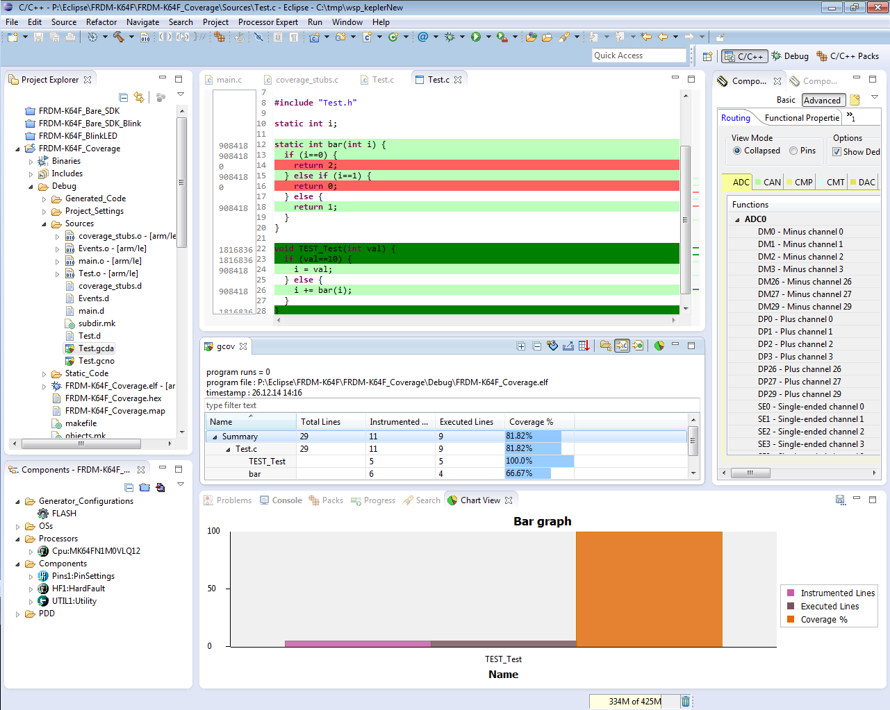
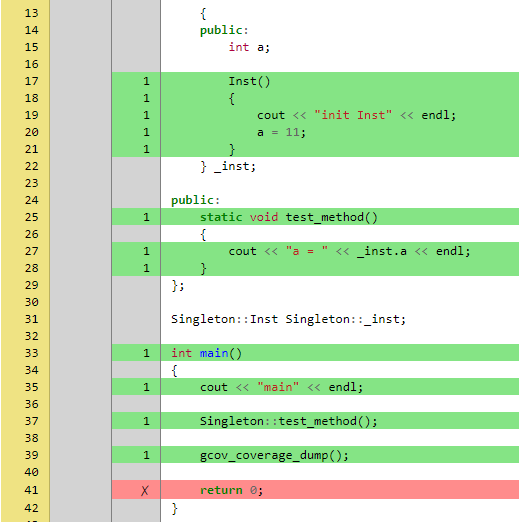

## `Code Coverage for Embedded Target with Eclipse, gcc and gcov`

# Requirement
## gcovr
Gcovr provides a utility for managing the use of the GNU gcov utility and generating summarized code coverage results. This command is inspired by the Python coverage.py package, which provides a similar utility for Python.

Gcovr is available as a Python package that can be installed via pip.

Install newest stable gcovr release from PyPI:
```
pip install gcovr
```
Install development version from GitHub:
```
pip install git+https://github.com/gcovr/gcovr.git
```
See: https://gcovr.com/en/stable/index.html

## Eclipse



# Source tree
```
report
|__coverage/index.html -- Example coverage report
...
sample
|__test.cpp     -- example code
test.bat        -- script build and run example 
scripts
|__coverage.py  -- Tool generate coverage report from coverage data
coverage
|__ coverage.c
|__ coverage.h
|__ gcov-port.h -- Porting some function for specific platform
|__ gcov.h

```

# Run example:
Delete folder report

Run command:
```
.\test.bat
```
Report file: report\coverage\index.html




# Try with your project
## Build project
* Add coverage/, gcov.h to your project

* Call gcov_coverage_dump if you want to retrieves gcov coverage data and sends it over the given interface.

* Compile the code for which you want to generate the coverage with these options:
```
CFLAGS: -fprofile-arcs -ftest-coverage

LFLAGS: -lgcov --coverage
```

## Collect coverage data
Run excutable file. Coverage data will be display on console. Copy them to `handler.log` file and save in report folder.

This is example coverage data:
```
GCOV_COVERAGE_DUMP_START
*C:\Users\linh9\Documents\source\ctest\main.c.gcda< 61 64 63 67 2a 32 31 42 5a 5a ...
*C:\Users\linh9\Documents\source\ctest\mytests.c.gcda< 61 64 00 00 00 01 03 00 00 00 8c 1a 70 33 a0 26 3e cb da ...
*C:\Users\linh9\Documents\source\ctest\coverage.c.gcda< 61 64 e9 ac 00 00 00 01 03 00 00 00 b9 31 42 6f d1 fc ...
GCOV_COVERAGE_DUMP_END
```

## Generate coverage report
```
python scripts/coverage.py <project_dir> <report_folder>
```

# Limitation
Missing data when alocate dynamicaly gcov data buffer
